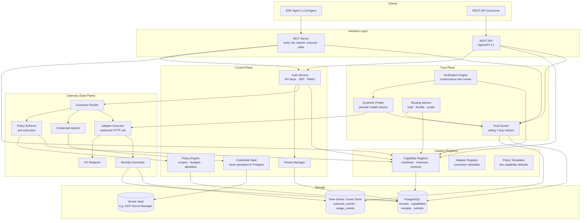

# 001 - Architecture

**Moat: Verified Agent Capabilities Marketplace**
*Component diagram, trust boundaries, and surface definitions*

---

## Overview

Moat is a four-plane architecture. Every agent action flows through all four planes in sequence. Nothing executes without policy clearance; nothing is trusted without scored evidence.

```
Agent (MCP client / REST caller)
        │
        ▼
┌──────────────────────────────────────────────────────────┐
│  MCP Server / REST Gateway (distribution surface)        │
│  - Capability discovery, search, execute, stats          │
│  - Auth: tenant API key → JWT                            │
└──────────────────┬───────────────────────────────────────┘
                   │
        ┌──────────┼──────────┐
        ▼          ▼          ▼
  [Control Plane] [Trust Plane] [Catalog]
        │
        ▼
┌──────────────────────────────────────────────────────────┐
│  Gateway (execution / data plane)                        │
│  - Policy enforcement                                    │
│  - Credential injection                                  │
│  - Outbound adapter call                                 │
│  - Receipt + outcome event emission                      │
└──────────────────────────────────────────────────────────┘
        │
        ▼
External Provider APIs (Slack, GitHub, Stripe, etc.)
```

---

## Component Diagram



---

## Plane Definitions

### Control Plane

Owns identity and policy configuration. Never executes capabilities.

| Component | Responsibility |
|-----------|---------------|
| Auth Service | Issue + validate tenant API keys and JWTs. RBAC enforcement. |
| Tenant Manager | Tenant provisioning, tier, quota assignment. |
| Credential Vault | Store provider tokens/keys via Secret Manager. Return opaque references. Never log raw secrets. |
| Policy Engine | Evaluate scope grants, budget caps, domain allowlists, approval requirements per tenant + capability. |

**Trust boundary:** The control plane accepts inbound admin/management API calls (authenticated). It issues signed assertions (JWT claims) consumed downstream by the gateway.

### Gateway (Data Plane / Execution Plane)

Executes capabilities on behalf of agents. Single point of enforcement.

| Component | Responsibility |
|-----------|---------------|
| Execution Router | Accept execute requests; route to correct adapter; coordinate pre/post pipeline. |
| Policy Enforcer | Pre-execution: check scope grant, budget headroom, domain allowlist, idempotency key. Hard deny = immediate 403 + PolicyDecision record. |
| Credential Injector | Fetch opaque credential reference from vault; inject into outbound request at call time. Never stored in request log. |
| Adapter Executor | Make outbound HTTP call to provider API within declared domain allowlist. Timeout enforcement. |
| Redactor | Strip forbidden keys (authorization, api_key, token, password, secret, credential) from logged input/output. Compute and store hashes only. |
| Receipt Generator | Emit signed Receipt record and OutcomeEvent after every execution attempt, including failures. |

**Trust boundary:** The gateway trusts JWT claims from control plane auth. It does not accept raw tenant secrets from callers. All outbound calls are bounded by domain allowlists declared in the capability manifest.

### Catalog (Registry)

Read-heavy, write-rare. Serves discovery. Not involved in execution hot path.

| Component | Responsibility |
|-----------|---------------|
| Capability Registry | Store and version CapabilityManifest records. Enforce immutability of published versions. |
| Adapter Registry | Connector metadata (base URLs, auth schemes, connector version). |
| Policy Templates | Default policy bundle per capability, overridable at tenant level. |

### Trust Plane

Async; does not block execution. Updates scores from outcome events.

| Component | Responsibility |
|-----------|---------------|
| Synthetic Prober | Runs scheduled probe calls against capabilities using test credentials. Emits synthetic outcome events. |
| Trust Scorer | Consumes outcome_events (real + synthetic); computes rolling 7-day success rate, p50/p95 latency. |
| Verification Engine | Runs conformance test suite against candidate capabilities. Awards Verified badge when criteria met. |
| Routing Advisor | Tags capabilities as hidden / throttled / preferred based on score thresholds. |

**Trust boundary:** Trust plane reads outcome events from the event store. It writes scores back to the catalog. It does not participate in the execution critical path.

---

## Interface Surfaces

### MCP Server

Primary agent interface. Exposes four tools:

| Tool | Purpose |
|------|---------|
| `capabilities.list` | Paginated catalog browse with filters |
| `capabilities.search` | Free-text + structured search |
| `capabilities.execute` | Invoke a capability with policy enforcement |
| `capabilities.stats` | Read trust scores for a capability |

### REST API (OpenAPI 3.1)

Human and integration-friendly. Mirrors MCP semantics.

| Group | Surface |
|-------|---------|
| Control Plane | `/capabilities`, `/connections`, `/tenants`, `/policies` |
| Gateway | `/execute/{capability_id}` |
| Trust Plane | `/capabilities/{id}/stats` |

---

## Key Design Constraints

1. **Default deny.** No capability executes unless policy explicitly grants it.
2. **Credential isolation.** Provider secrets never appear in request payloads, logs, or Postgres. Vault only.
3. **Immutable receipts.** Every execution attempt (success or failure) produces a receipt. Receipts are write-once.
4. **Trust is earned, not declared.** Verified badge requires passing conformance suite and 7 days of clean synthetic checks.
5. **Outbound domain allowlists are mandatory.** Capabilities must declare their allowed outbound domains. Requests to undeclared hosts are rejected by the gateway.
