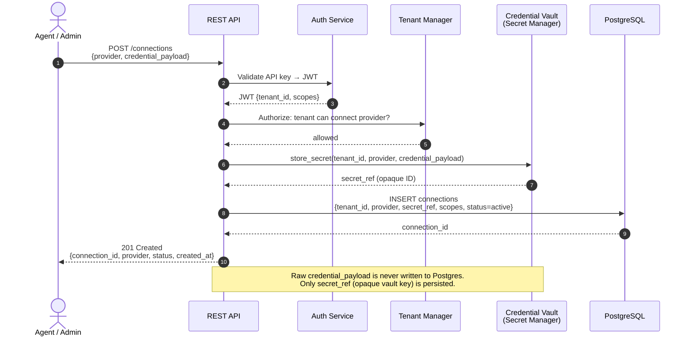
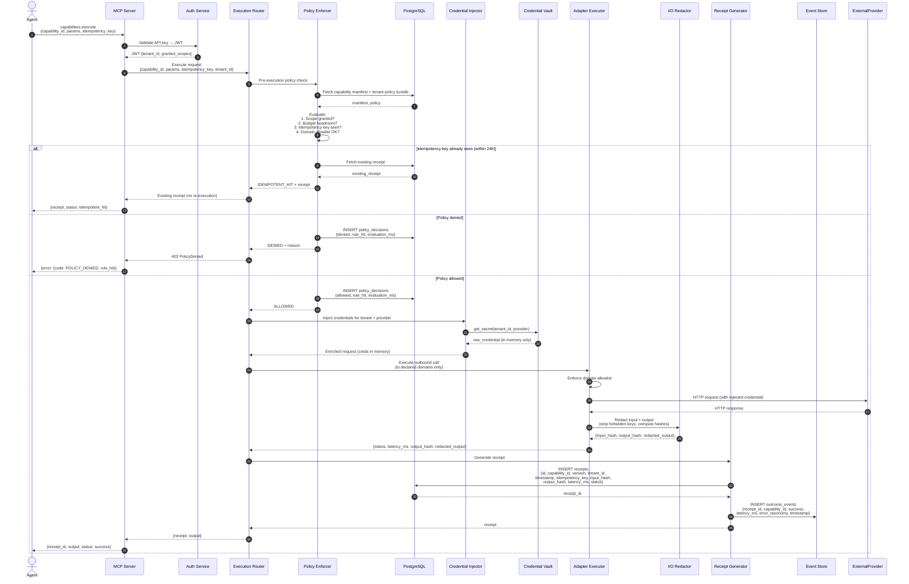
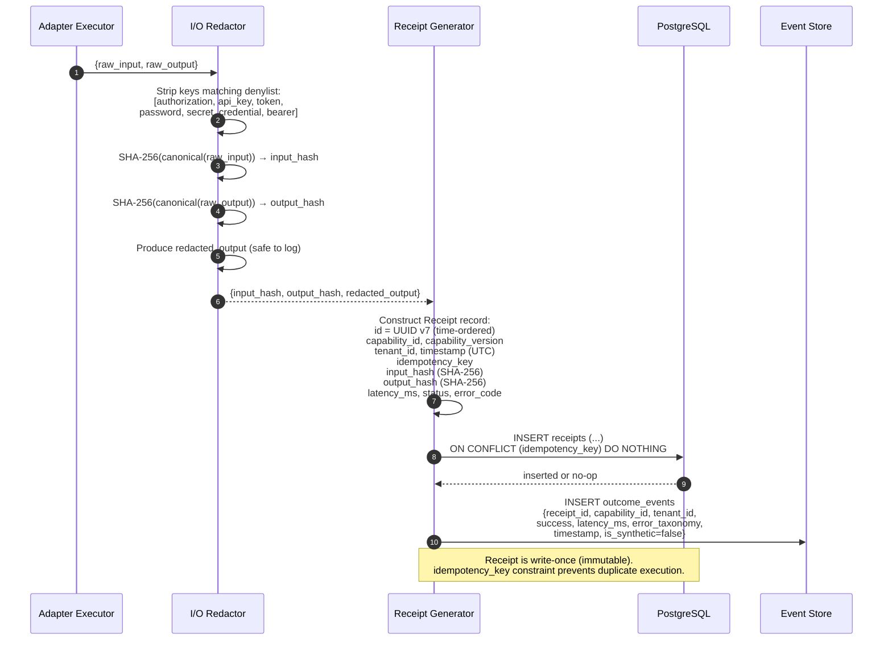
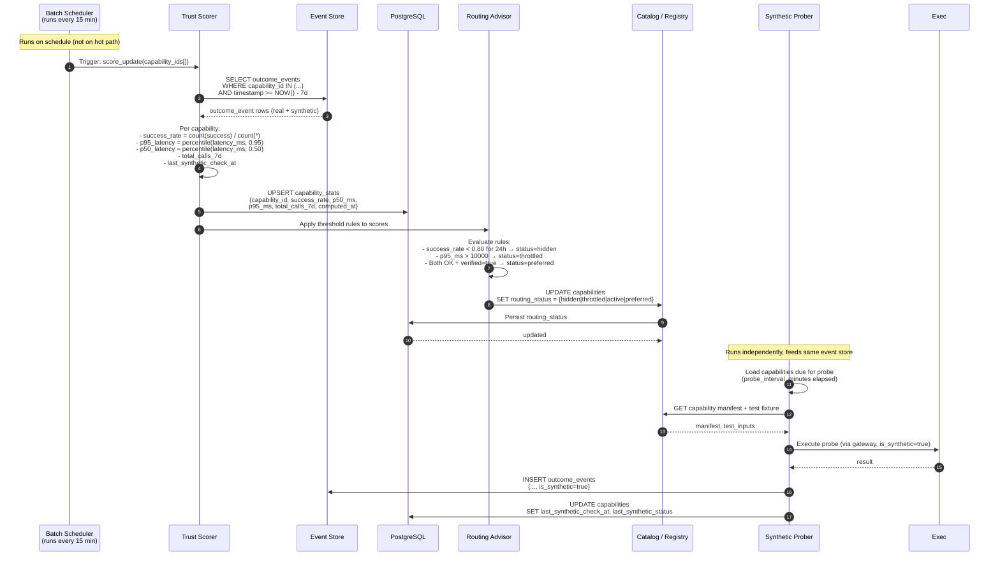

# 002 - Request Flows

**Moat: Verified Agent Capabilities Marketplace**
*Sequence diagrams for all primary flows*

---

## 1. Credential Connect Flow

An agent or admin registers a provider credential for a tenant. The raw secret enters once and is immediately handed to the vault; only an opaque reference is stored in Postgres.

---

## 2. Execute Capability Flow (Full Pipeline)

The critical path: policy check, credential injection, outbound call, redaction, receipt generation, outcome event emission.

---

## 3. Receipt Generation Detail

Zooms into the receipt generation sub-flow to show hashing and storage guarantees.

---

## 4. Trust Scoring Update Flow

Async batch pipeline that consumes outcome events and updates capability trust scores. Does not block execution.

---

## Flow Summary Table

| Flow | Trigger | Latency Target | Side Effects |
|------|---------|---------------|--------------|
| Credential Connect | Admin POST /connections | < 500ms | connection row, vault secret |
| Execute Capability | Agent call | < p95 of provider + 50ms overhead | receipt, policy_decision, outcome_event |
| Idempotent Hit | Duplicate idempotency_key | < 50ms | no re-execution; returns cached receipt |
| Policy Denied | Policy evaluation fails | < 20ms | policy_decision record only |
| Receipt Generation | Every execute attempt | Inline, async write | receipt row, outcome_event row |
| Trust Score Update | Batch, every 15 min | Background | capability_stats, routing_status |
| Synthetic Probe | Scheduled per-capability | Background | synthetic outcome_events |
