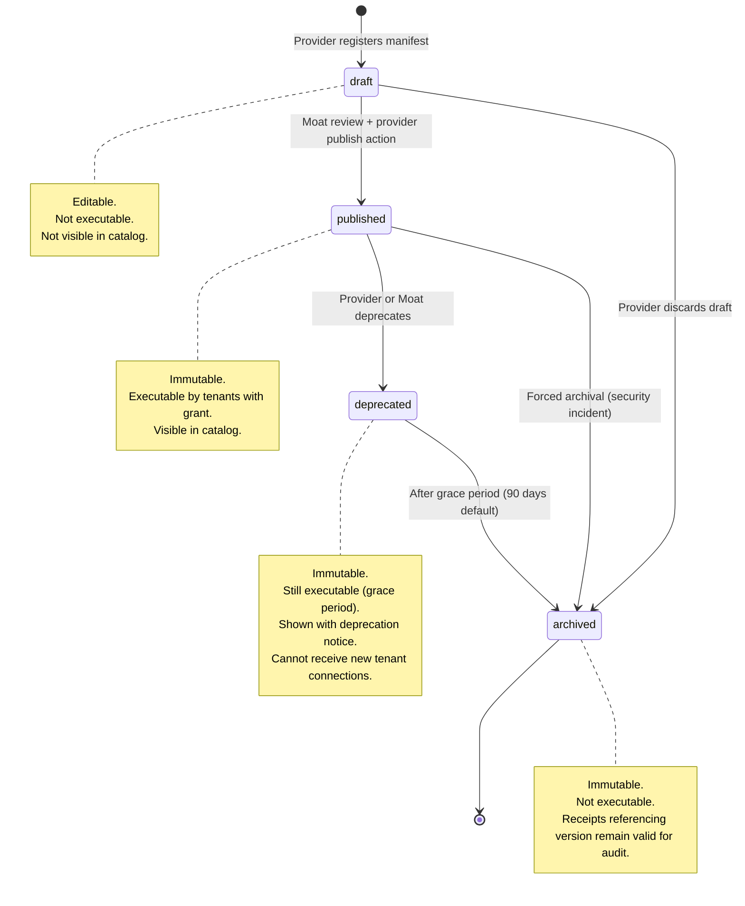

# 003 - Capability Specification

**Moat: Verified Agent Capabilities Marketplace**
*CapabilityManifest schema, versioning rules, and lifecycle*

---

## Overview

A **CapabilityManifest** is the contract between a capability provider and Moat. It declares everything the gateway needs to execute safely: the method, required scopes, input/output schemas, risk class, and outbound domain allowlist.

Manifests are registered in the Catalog. Published versions are immutable.

---

## CapabilityManifest Schema

### Pydantic Model Definition

```python
from __future__ import annotations

from enum import Enum
from typing import Any

from pydantic import BaseModel, Field, HttpUrl, field_validator


class RiskClass(str, Enum):
    """
    Risk classification for the capability.

    LOW    - Read-only, no side effects (e.g., fetch public data).
    MEDIUM - Write or mutate with bounded scope (e.g., post a message).
    HIGH   - Irreversible actions or access to sensitive data
             (e.g., send payment, delete resource).
    CRITICAL - Requires explicit human approval gate before execution.
    """
    LOW = "low"
    MEDIUM = "medium"
    HIGH = "high"
    CRITICAL = "critical"


class CapabilityStatus(str, Enum):
    DRAFT = "draft"
    PUBLISHED = "published"
    DEPRECATED = "deprecated"
    ARCHIVED = "archived"


class CapabilityManifest(BaseModel):
    """
    Canonical contract for a Moat capability.
    Published versions are immutable; use a new semver to change behavior.
    """

    # --- Identity ---
    id: str = Field(
        ...,
        description="Globally unique capability ID. Format: {provider}.{method}",
        pattern=r"^[a-z0-9_]+\.[a-z0-9_]+$",
        examples=["slack.post_message", "github.create_issue"],
    )
    name: str = Field(
        ...,
        description="Human-readable display name.",
        max_length=128,
        examples=["Post Slack Message", "Create GitHub Issue"],
    )
    version: str = Field(
        ...,
        description="Semantic version string (semver). Published versions are immutable.",
        pattern=r"^\d+\.\d+\.\d+$",
        examples=["1.0.0", "2.3.1"],
    )
    description: str = Field(
        ...,
        description="One-to-two sentence description of what the capability does.",
        max_length=512,
    )

    # --- Provider ---
    provider: str = Field(
        ...,
        description="Provider identifier (e.g., 'slack', 'github', 'stripe').",
        pattern=r"^[a-z0-9_]+$",
        examples=["slack", "github", "stripe"],
    )
    adapter_id: str = Field(
        ...,
        description="Reference to the adapter that implements this capability.",
        examples=["slack-adapter-v2", "github-rest-v1"],
    )

    # --- Method and Scopes ---
    method: str = Field(
        ...,
        description=(
            "The specific method this capability invokes. "
            "Format: {provider}.{action}. Used for scope grant checks."
        ),
        pattern=r"^[a-z0-9_]+\.[a-z0-9_]+$",
        examples=["slack.post_message", "github.create_issue"],
    )
    scopes: list[str] = Field(
        ...,
        description=(
            "Required method-level scopes that a tenant must have granted "
            "to execute this capability."
        ),
        min_length=1,
        examples=[["slack.post_message"], ["github.create_issue", "github.read_repo"]],
    )

    # --- Schemas ---
    input_schema: dict[str, Any] = Field(
        ...,
        description=(
            "JSON Schema (Draft 7) for the capability input parameters. "
            "The gateway validates inbound params against this schema before execution."
        ),
    )
    output_schema: dict[str, Any] = Field(
        ...,
        description=(
            "JSON Schema (Draft 7) for the capability output. "
            "The gateway validates adapter output against this schema."
        ),
    )

    # --- Risk and Security ---
    risk_class: RiskClass = Field(
        ...,
        description=(
            "Risk classification. Determines default policy behavior and "
            "whether an approval gate is required."
        ),
    )
    domain_allowlist: list[str] = Field(
        ...,
        description=(
            "Explicit list of hostnames the adapter is allowed to call. "
            "The gateway rejects outbound requests to any host not in this list. "
            "Must be non-empty. No wildcards."
        ),
        min_length=1,
        examples=[["slack.com", "files.slack.com"], ["api.github.com"]],
    )

    # --- Categorization ---
    category: str = Field(
        ...,
        description="Capability category for catalog browsing.",
        examples=["messaging", "code", "payments", "data", "storage"],
    )
    tags: list[str] = Field(
        default_factory=list,
        description="Free-form tags for search and filtering.",
        examples=[["notifications", "team-collaboration"]],
    )

    # --- Lifecycle ---
    status: CapabilityStatus = Field(
        default=CapabilityStatus.DRAFT,
        description="Lifecycle status. Only published capabilities are executable.",
    )
    deprecated_at: str | None = Field(
        default=None,
        description="ISO 8601 datetime when the capability was deprecated.",
    )
    deprecation_notice: str | None = Field(
        default=None,
        description="Human-readable deprecation reason and migration path.",
        max_length=512,
    )

    # --- Trust ---
    verified: bool = Field(
        default=False,
        description=(
            "True if the capability has passed the conformance test suite "
            "and 7 days of clean synthetic checks."
        ),
    )
    verified_at: str | None = Field(
        default=None,
        description="ISO 8601 datetime when the Verified badge was awarded.",
    )

    # --- Metadata ---
    created_at: str = Field(
        ...,
        description="ISO 8601 datetime of initial creation.",
    )
    published_at: str | None = Field(
        default=None,
        description="ISO 8601 datetime when status transitioned to published.",
    )
    created_by: str = Field(
        ...,
        description="User or service account that created this capability version.",
    )

    @field_validator("domain_allowlist")
    @classmethod
    def no_wildcards_in_allowlist(cls, v: list[str]) -> list[str]:
        for domain in v:
            if "*" in domain:
                raise ValueError(
                    f"Wildcard domains are not allowed in domain_allowlist: {domain!r}"
                )
        return v

    @field_validator("scopes")
    @classmethod
    def scopes_match_method_prefix(cls, v: list[str], info: Any) -> list[str]:
        """Primary scope must share the provider prefix with the method."""
        # Informational validation; enforcement is in policy engine.
        return v

    class Config:
        use_enum_values = True
```

---

## Canonical Example

```json
{
  "id": "slack.post_message",
  "name": "Post Slack Message",
  "version": "1.2.0",
  "description": "Posts a message to a Slack channel or DM. Supports text and blocks.",
  "provider": "slack",
  "adapter_id": "slack-adapter-v2",
  "method": "slack.post_message",
  "scopes": ["slack.post_message"],
  "input_schema": {
    "$schema": "http://json-schema.org/draft-07/schema#",
    "type": "object",
    "required": ["channel", "text"],
    "properties": {
      "channel": {
        "type": "string",
        "description": "Channel ID or DM user ID (e.g., C01234ABCDE or U01234ABCDE)"
      },
      "text": {
        "type": "string",
        "maxLength": 4000
      },
      "blocks": {
        "type": "array",
        "description": "Optional Block Kit blocks.",
        "items": {"type": "object"}
      }
    },
    "additionalProperties": false
  },
  "output_schema": {
    "$schema": "http://json-schema.org/draft-07/schema#",
    "type": "object",
    "required": ["ts", "channel", "ok"],
    "properties": {
      "ok": {"type": "boolean"},
      "ts": {"type": "string"},
      "channel": {"type": "string"},
      "message": {"type": "object"}
    }
  },
  "risk_class": "medium",
  "domain_allowlist": ["slack.com", "files.slack.com"],
  "category": "messaging",
  "tags": ["slack", "notifications", "team-collaboration"],
  "status": "published",
  "verified": true,
  "verified_at": "2026-01-15T00:00:00Z",
  "created_at": "2026-01-01T00:00:00Z",
  "published_at": "2026-01-10T00:00:00Z",
  "created_by": "provider:slack-official",
  "deprecated_at": null,
  "deprecation_notice": null
}
```

---

## Versioning Rules

### Semver Contract

Moat uses **strict semantic versioning** for capability manifests:

| Change Type | Version Bump | Notes |
|-------------|-------------|-------|
| New optional input field | PATCH (1.0.x) | Backwards compatible |
| New optional output field | PATCH (1.0.x) | Backwards compatible |
| New required input field | MAJOR (x.0.0) | Breaking: existing callers must update |
| Remove/rename any field | MAJOR (x.0.0) | Breaking |
| Change input/output type | MAJOR (x.0.0) | Breaking |
| New optional scope | MINOR (1.x.0) | Additive |
| Risk class upgrade | MINOR (1.x.0) | Requires policy review by tenants |
| Domain allowlist change | MINOR (1.x.0) | Reviewed by Moat security |
| Bug fix in adapter logic | PATCH (1.0.x) | No schema change |

### Immutability Rule

**A published capability version is immutable.** Once `status=published`, the manifest record for that `(id, version)` pair cannot be modified. To change behavior:

1. Create a new version in `draft` status.
2. Validate and publish the new version.
3. Optionally deprecate the old version.

This guarantees that receipts citing `capability_id` + `capability_version` are permanently auditable.

---

## Capability Lifecycle



### Lifecycle Rules

| Transition | Who Can Trigger | Effect |
|-----------|----------------|--------|
| `draft → published` | Provider (with Moat approval for HIGH/CRITICAL) | Capability appears in catalog; becomes executable |
| `published → deprecated` | Provider or Moat | Deprecation notice shown; execution still permitted during grace period |
| `published → archived` | Moat only (security/abuse) | Immediate execution block |
| `deprecated → archived` | Automatic after grace period | Execution blocked; receipt history preserved |

### Grace Period

Default deprecation grace period: **90 days**. During this window:
- Existing tenant connections remain valid.
- Executions succeed but responses include a `X-Moat-Deprecation-Notice` header.
- New tenant connections to the deprecated version are rejected.
- Trust scoring continues; synthetic probes stop at deprecation.

---

## Capability ID Naming Convention

```
{provider}.{action}

Examples:
  slack.post_message
  slack.list_channels
  github.create_issue
  github.merge_pull_request
  stripe.create_payment_intent
  stripe.refund_charge
  sendgrid.send_email
  twilio.send_sms
```

**Rules:**
- Lowercase, underscores only (no hyphens).
- Provider segment must match the `provider` field.
- Action segment should be a verb + noun describing the side effect.
- IDs are globally unique across all providers.
- Cannot be reused after archival.
