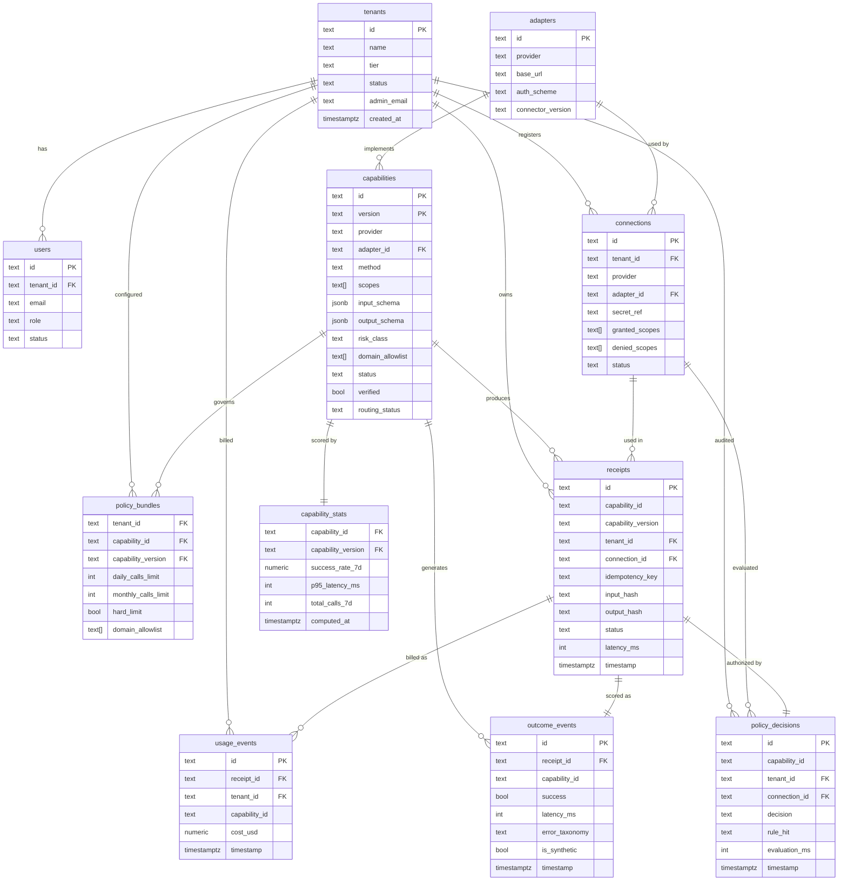

# 006 - Data Model

**Moat: Verified Agent Capabilities Marketplace**
*Table definitions, partitioning strategy, indexes, and ERD*

---

## Overview

Moat uses **PostgreSQL** as the primary relational store. Time-series telemetry tables (`outcome_events`, `usage_events`) use **monthly range partitioning** for query efficiency and retention management. Credential secrets are never stored in Postgres; only opaque vault references.

---

## Table Definitions

### `tenants`

The top-level billing and policy unit.

```sql
CREATE TABLE tenants (
    id              TEXT PRIMARY KEY,           -- e.g., "tenant_acme"
    name            TEXT NOT NULL,
    tier            TEXT NOT NULL DEFAULT 'free'
                    CHECK (tier IN ('free', 'pro', 'enterprise')),
    status          TEXT NOT NULL DEFAULT 'active'
                    CHECK (status IN ('active', 'suspended', 'deleted')),
    created_at      TIMESTAMPTZ NOT NULL DEFAULT NOW(),
    updated_at      TIMESTAMPTZ NOT NULL DEFAULT NOW(),

    -- Billing
    stripe_customer_id  TEXT,

    -- Config
    default_budget_daily_calls      INT,    -- NULL = platform default
    default_budget_monthly_calls    INT,    -- NULL = platform default

    -- Contact
    admin_email     TEXT NOT NULL,

    CONSTRAINT tenants_id_format CHECK (id ~ '^tenant_[a-z0-9_]+$')
);

CREATE INDEX idx_tenants_status ON tenants (status);
```

---

### `users`

Humans who authenticate to manage their tenant's connections and policies.

```sql
CREATE TABLE users (
    id              TEXT PRIMARY KEY,           -- UUID v7
    tenant_id       TEXT NOT NULL REFERENCES tenants(id),
    email           TEXT NOT NULL,
    role            TEXT NOT NULL DEFAULT 'member'
                    CHECK (role IN ('owner', 'admin', 'member', 'viewer')),
    status          TEXT NOT NULL DEFAULT 'active'
                    CHECK (status IN ('active', 'suspended', 'deleted')),
    created_at      TIMESTAMPTZ NOT NULL DEFAULT NOW(),
    updated_at      TIMESTAMPTZ NOT NULL DEFAULT NOW(),

    CONSTRAINT users_email_unique UNIQUE (tenant_id, email)
);

CREATE INDEX idx_users_tenant_id ON users (tenant_id);
CREATE INDEX idx_users_email ON users (email);
```

---

### `capabilities`

The canonical capability registry. One row per `(id, version)` pair.

```sql
CREATE TABLE capabilities (
    id              TEXT NOT NULL,              -- e.g., "slack.post_message"
    version         TEXT NOT NULL,             -- semver, e.g., "1.2.0"
    name            TEXT NOT NULL,
    description     TEXT NOT NULL,
    provider        TEXT NOT NULL,
    adapter_id      TEXT NOT NULL REFERENCES adapters(id),
    method          TEXT NOT NULL,
    scopes          TEXT[] NOT NULL,
    input_schema    JSONB NOT NULL,
    output_schema   JSONB NOT NULL,
    risk_class      TEXT NOT NULL
                    CHECK (risk_class IN ('low', 'medium', 'high', 'critical')),
    domain_allowlist TEXT[] NOT NULL,
    category        TEXT NOT NULL,
    tags            TEXT[] NOT NULL DEFAULT '{}',

    -- Lifecycle
    status          TEXT NOT NULL DEFAULT 'draft'
                    CHECK (status IN ('draft', 'published', 'deprecated', 'archived')),
    created_at      TIMESTAMPTZ NOT NULL DEFAULT NOW(),
    published_at    TIMESTAMPTZ,
    deprecated_at   TIMESTAMPTZ,
    deprecation_notice TEXT,
    archived_at     TIMESTAMPTZ,
    created_by      TEXT NOT NULL,

    -- Trust
    verified        BOOLEAN NOT NULL DEFAULT FALSE,
    verified_at     TIMESTAMPTZ,
    routing_status  TEXT NOT NULL DEFAULT 'active'
                    CHECK (routing_status IN ('active', 'preferred', 'throttled', 'hidden')),

    PRIMARY KEY (id, version),

    -- Immutability: published/deprecated/archived versions cannot change
    -- Enforced via trigger (see migrations)
    CONSTRAINT capabilities_version_format
        CHECK (version ~ '^\d+\.\d+\.\d+$')
);

CREATE INDEX idx_capabilities_provider ON capabilities (provider);
CREATE INDEX idx_capabilities_status ON capabilities (status);
CREATE INDEX idx_capabilities_category ON capabilities (category);
CREATE INDEX idx_capabilities_routing_status ON capabilities (routing_status);
CREATE INDEX idx_capabilities_verified ON capabilities (verified) WHERE verified = TRUE;
-- Full-text search index
CREATE INDEX idx_capabilities_fts ON capabilities
    USING GIN (to_tsvector('english', name || ' ' || description || ' ' || category));
```

---

### `adapters`

Connector metadata. Decoupled from capability manifests so an adapter can serve multiple capabilities.

```sql
CREATE TABLE adapters (
    id              TEXT PRIMARY KEY,           -- e.g., "slack-adapter-v2"
    provider        TEXT NOT NULL,
    display_name    TEXT NOT NULL,
    base_url        TEXT NOT NULL,
    auth_scheme     TEXT NOT NULL
                    CHECK (auth_scheme IN ('bearer', 'oauth2', 'api_key', 'basic')),
    connector_version TEXT NOT NULL,
    status          TEXT NOT NULL DEFAULT 'active'
                    CHECK (status IN ('active', 'deprecated', 'archived')),
    created_at      TIMESTAMPTZ NOT NULL DEFAULT NOW(),
    updated_at      TIMESTAMPTZ NOT NULL DEFAULT NOW()
);

CREATE INDEX idx_adapters_provider ON adapters (provider);
```

---

### `connections`

A tenant's registered credential for a provider. Stores only an opaque vault reference.

```sql
CREATE TABLE connections (
    id              TEXT PRIMARY KEY,           -- UUID v7
    tenant_id       TEXT NOT NULL REFERENCES tenants(id),
    provider        TEXT NOT NULL,
    adapter_id      TEXT NOT NULL REFERENCES adapters(id),

    -- Vault reference (never the raw secret)
    secret_ref      TEXT NOT NULL,             -- Opaque GCP Secret Manager path

    -- Scope grants (what the tenant has authorized Moat to do)
    granted_scopes  TEXT[] NOT NULL DEFAULT '{}',
    denied_scopes   TEXT[] NOT NULL DEFAULT '{}',

    status          TEXT NOT NULL DEFAULT 'active'
                    CHECK (status IN ('active', 'revoked', 'expired')),
    created_at      TIMESTAMPTZ NOT NULL DEFAULT NOW(),
    updated_at      TIMESTAMPTZ NOT NULL DEFAULT NOW(),
    expires_at      TIMESTAMPTZ,               -- NULL = no expiry

    CONSTRAINT connections_tenant_provider_unique UNIQUE (tenant_id, provider)
);

CREATE INDEX idx_connections_tenant_id ON connections (tenant_id);
CREATE INDEX idx_connections_provider ON connections (provider);
CREATE INDEX idx_connections_status ON connections (status);
```

---

### `policy_bundles`

Effective policy for a `(tenant, capability)` pair. Cached and refreshed on change.

```sql
CREATE TABLE policy_bundles (
    tenant_id           TEXT NOT NULL REFERENCES tenants(id),
    capability_id       TEXT NOT NULL,
    capability_version  TEXT NOT NULL,

    -- Scope grants (from connection)
    granted_scopes  TEXT[] NOT NULL DEFAULT '{}',
    denied_scopes   TEXT[] NOT NULL DEFAULT '{}',

    -- Budget config (tenant override > capability default > platform default)
    daily_calls_limit       INT,               -- NULL = unlimited
    monthly_calls_limit     INT,               -- NULL = unlimited
    daily_cost_usd_limit    NUMERIC(12, 4),
    monthly_cost_usd_limit  NUMERIC(12, 4),
    hard_limit              BOOLEAN NOT NULL DEFAULT TRUE,

    -- Domain allowlist (from capability manifest, not overridable)
    domain_allowlist TEXT[] NOT NULL DEFAULT '{}',

    -- Approval gates
    approval_gate_enabled               BOOLEAN NOT NULL DEFAULT FALSE,
    approval_gate_risk_classes          TEXT[] NOT NULL DEFAULT '{critical}',

    computed_at     TIMESTAMPTZ NOT NULL DEFAULT NOW(),

    PRIMARY KEY (tenant_id, capability_id, capability_version),
    FOREIGN KEY (capability_id, capability_version) REFERENCES capabilities(id, version)
);

CREATE INDEX idx_policy_bundles_tenant ON policy_bundles (tenant_id);
```

---

### `policy_decisions`

Immutable audit log of every policy evaluation.

```sql
CREATE TABLE policy_decisions (
    id                  TEXT PRIMARY KEY,       -- UUID v7
    capability_id       TEXT NOT NULL,
    capability_version  TEXT NOT NULL,
    tenant_id           TEXT NOT NULL,
    connection_id       TEXT REFERENCES connections(id),
    request_id          TEXT NOT NULL,
    timestamp           TIMESTAMPTZ NOT NULL DEFAULT NOW(),

    decision            TEXT NOT NULL CHECK (decision IN ('allowed', 'denied')),
    rule_hit            TEXT NOT NULL,
    evaluation_ms       INT NOT NULL,

    requested_scopes    TEXT[] NOT NULL DEFAULT '{}',
    granted_scopes      TEXT[] NOT NULL DEFAULT '{}',
    budget_state        JSONB NOT NULL DEFAULT '{}',
    idempotency_key     TEXT,
    is_synthetic        BOOLEAN NOT NULL DEFAULT FALSE
);

CREATE INDEX idx_policy_decisions_tenant_ts ON policy_decisions (tenant_id, timestamp DESC);
CREATE INDEX idx_policy_decisions_capability ON policy_decisions (capability_id, timestamp DESC);
CREATE INDEX idx_policy_decisions_decision ON policy_decisions (decision, timestamp DESC);
```

---

### `receipts`

Write-once execution receipts. Partitioned by month for retention management.

```sql
CREATE TABLE receipts (
    id                  TEXT NOT NULL,          -- UUID v7
    capability_id       TEXT NOT NULL,
    capability_version  TEXT NOT NULL,
    adapter_id          TEXT NOT NULL,
    tenant_id           TEXT NOT NULL,
    connection_id       TEXT NOT NULL,
    request_id          TEXT NOT NULL,
    timestamp           TIMESTAMPTZ NOT NULL DEFAULT NOW(),
    latency_ms          INT NOT NULL,
    idempotency_key     TEXT NOT NULL,
    input_hash          TEXT NOT NULL,          -- SHA-256
    output_hash         TEXT,                   -- SHA-256, NULL on failure
    status              TEXT NOT NULL,
    error_code          TEXT,
    http_status         INT,
    policy_decision_id  TEXT NOT NULL,
    is_synthetic        BOOLEAN NOT NULL DEFAULT FALSE,

    PRIMARY KEY (id, timestamp),

    -- Idempotency constraint
    CONSTRAINT receipts_idempotency UNIQUE (tenant_id, idempotency_key, timestamp)
    -- Note: UNIQUE includes timestamp because of partitioning. Idempotency enforced in application.
) PARTITION BY RANGE (timestamp);

-- Monthly partitions (created by migration scripts or pg_partman)
CREATE TABLE receipts_2026_01 PARTITION OF receipts
    FOR VALUES FROM ('2026-01-01') TO ('2026-02-01');
CREATE TABLE receipts_2026_02 PARTITION OF receipts
    FOR VALUES FROM ('2026-02-01') TO ('2026-03-01');
-- ... etc.

CREATE INDEX idx_receipts_tenant_ts ON receipts (tenant_id, timestamp DESC);
CREATE INDEX idx_receipts_capability_ts ON receipts (capability_id, timestamp DESC);
CREATE INDEX idx_receipts_idempotency ON receipts (tenant_id, idempotency_key);
CREATE INDEX idx_receipts_status ON receipts (status, timestamp DESC);
```

---

### `usage_events`

Budget counter source of truth. One row per billable execution. Partitioned by month.

```sql
CREATE TABLE usage_events (
    id              TEXT NOT NULL,              -- UUID v7
    receipt_id      TEXT NOT NULL,
    tenant_id       TEXT NOT NULL,
    capability_id   TEXT NOT NULL,
    timestamp       TIMESTAMPTZ NOT NULL DEFAULT NOW(),

    -- Cost (NULL until pricing is added)
    cost_usd        NUMERIC(12, 8),

    PRIMARY KEY (id, timestamp)
) PARTITION BY RANGE (timestamp);

CREATE TABLE usage_events_2026_01 PARTITION OF usage_events
    FOR VALUES FROM ('2026-01-01') TO ('2026-02-01');
-- ... etc.

CREATE INDEX idx_usage_events_tenant_ts ON usage_events (tenant_id, timestamp DESC);
CREATE INDEX idx_usage_events_capability ON usage_events (capability_id, timestamp DESC);
```

---

### `outcome_events`

Telemetry for Trust Plane scoring. Partitioned by month.

```sql
CREATE TABLE outcome_events (
    id                  TEXT NOT NULL,          -- UUID v7
    receipt_id          TEXT NOT NULL,
    capability_id       TEXT NOT NULL,
    capability_version  TEXT NOT NULL,
    tenant_id           TEXT NOT NULL,
    adapter_id          TEXT NOT NULL,
    success             BOOLEAN NOT NULL,
    latency_ms          INT NOT NULL,
    error_taxonomy      TEXT NOT NULL,
    http_status         INT,
    timestamp           TIMESTAMPTZ NOT NULL DEFAULT NOW(),
    is_synthetic        BOOLEAN NOT NULL DEFAULT FALSE,

    PRIMARY KEY (id, timestamp)
) PARTITION BY RANGE (timestamp);

CREATE TABLE outcome_events_2026_01 PARTITION OF outcome_events
    FOR VALUES FROM ('2026-01-01') TO ('2026-02-01');
-- ... etc.

CREATE INDEX idx_outcome_events_capability_ts ON outcome_events (capability_id, timestamp DESC);
CREATE INDEX idx_outcome_events_success ON outcome_events (capability_id, success, timestamp DESC);
CREATE INDEX idx_outcome_events_synthetic ON outcome_events (capability_id, is_synthetic, timestamp DESC);
```

---

### `capability_stats`

Pre-computed rolling metrics per capability. Updated by the Trust Scorer batch job.

```sql
CREATE TABLE capability_stats (
    capability_id       TEXT NOT NULL,
    capability_version  TEXT NOT NULL,
    computed_at         TIMESTAMPTZ NOT NULL DEFAULT NOW(),

    -- Rolling 7-day metrics
    success_rate_7d     NUMERIC(5, 4),          -- 0.0000 to 1.0000
    p50_latency_ms      INT,
    p95_latency_ms      INT,
    total_calls_7d      INT NOT NULL DEFAULT 0,
    total_calls_30d     INT NOT NULL DEFAULT 0,

    -- Synthetic probe
    last_synthetic_check_at     TIMESTAMPTZ,
    last_synthetic_status       TEXT,           -- "success" | "failure"

    PRIMARY KEY (capability_id, capability_version),
    FOREIGN KEY (capability_id, capability_version) REFERENCES capabilities(id, version)
);

CREATE INDEX idx_capability_stats_success_rate ON capability_stats (success_rate_7d);
CREATE INDEX idx_capability_stats_p95 ON capability_stats (p95_latency_ms);
```

---

## Partitioning Strategy

| Table | Partition Key | Partition Size | Retention |
|-------|-------------|---------------|----------|
| `receipts` | `timestamp` | Monthly | 13 months (configurable) |
| `outcome_events` | `timestamp` | Monthly | 13 months |
| `usage_events` | `timestamp` | Monthly | 36 months (billing) |
| `policy_decisions` | `timestamp` (via index) | Not partitioned | 24 months |

New partitions are created automatically by `pg_partman` or a migration script run at the start of each month. Old partitions are detached and archived (not dropped) to preserve audit history.

---

## Index Strategy

### Query Patterns and Supporting Indexes

| Query Pattern | Table | Index |
|--------------|-------|-------|
| "Show all receipts for tenant in last 30 days" | `receipts` | `(tenant_id, timestamp DESC)` |
| "Look up receipt by idempotency key" | `receipts` | `(tenant_id, idempotency_key)` |
| "Get outcome events for capability in last 7 days" | `outcome_events` | `(capability_id, timestamp DESC)` |
| "Count successes for scoring" | `outcome_events` | `(capability_id, success, timestamp DESC)` |
| "List published capabilities by category" | `capabilities` | `(status, category)` |
| "Full-text search in catalog" | `capabilities` | GIN on `tsvector` |
| "Find verified capabilities" | `capabilities` | `(verified)` partial |
| "Policy decisions for audit" | `policy_decisions` | `(tenant_id, timestamp DESC)` |
| "Check connection scope grants" | `connections` | `(tenant_id, provider)` unique |
| "Budget calculation (daily/monthly)" | `usage_events` | `(tenant_id, timestamp DESC)` |

---

## ERD


