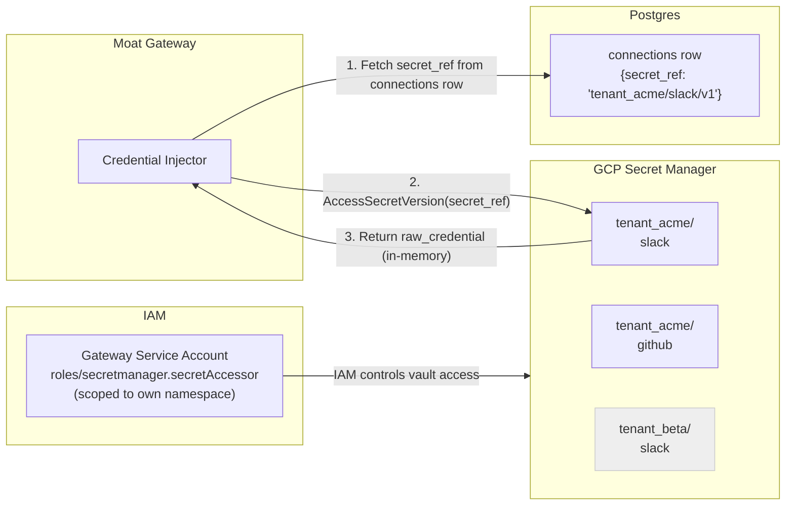

# 007 - Security

**Moat: Verified Agent Capabilities Marketplace**
*Threat model, controls, and default-deny posture*

---

## Security Posture Summary

Moat's security model is built around one principle: **the gateway is the only entity that touches provider credentials and makes outbound calls.** Every other component is either read-only (catalog, trust plane) or write-only to controlled stores (receipts, events). The attack surface is minimal by design.

Default posture: **deny everything, allow only what is explicitly declared.**

---

## Threat Model

### Threat 1: SSRF / Open Proxy

**Description:** An attacker crafts capability inputs that cause the gateway to make outbound HTTP requests to internal infrastructure (cloud metadata endpoints, internal services, databases).

**Risk:** HIGH. The gateway has network access to internal resources. If outbound calls are not bounded, a malicious capability or payload could exfiltrate internal data or trigger internal API calls.

**Controls:**

| Control | Mechanism |
|---------|----------|
| Domain allowlist | Every capability manifest declares its `domain_allowlist`. Gateway rejects requests to any host not on the list. |
| No wildcard domains | `field_validator` in CapabilityManifest rejects `*` in domain entries. |
| No IP literals | Capability manifests may not include IP addresses in `domain_allowlist`. Regex enforced at registration. |
| Post-DNS private IP check | After DNS resolution, the gateway checks resolved IP against RFC-1918 ranges (10.0.0.0/8, 172.16.0.0/12, 192.168.0.0/16, 127.0.0.0/8, 169.254.0.0/16). Rejects if private. |
| Port restriction | Only ports 80 and 443 are permitted for outbound calls. |
| No redirect following | HTTP redirects are not followed unless the redirect target is also in `domain_allowlist`. |
| Egress firewall | At infrastructure level (VPC egress rules), outbound traffic from the gateway service is restricted to known provider IP ranges (defense-in-depth). |

---

### Threat 2: Credential Theft

**Description:** Attacker reads provider secrets from logs, database, or memory. Compromised secrets give access to tenant's connected provider accounts.

**Risk:** CRITICAL. Provider tokens (Slack, GitHub, Stripe) are high-value targets.

**Controls:**

| Control | Mechanism |
|---------|----------|
| Vault-only storage | Provider credentials are stored in GCP Secret Manager (or equivalent vault). Never written to Postgres, never logged. |
| Opaque references | Postgres stores only `secret_ref` (an opaque vault path). The reference is useless without vault access. |
| In-memory only at call time | Credentials are fetched from vault immediately before the outbound call and discarded after. Never held in persistent memory or request context beyond the call. |
| Redaction at input | I/O redactor strips keys matching the secret denylist from all logged data before writing to any store. |
| No credential in JWT | JWTs carry tenant/scope claims only. No credential material. |
| Vault access logging | All reads of `secret_ref` from vault are logged in vault's audit trail (separate from Moat logs). |
| Least-privilege vault IAM | Gateway service account has `secretmanager.versions.access` only for its own namespace. Cannot enumerate or read other tenants' secrets. |

---

### Threat 3: Tenant Breakout

**Description:** Tenant A reads, executes, or manipulates data belonging to Tenant B. In a multi-tenant system, row-level isolation is critical.

**Risk:** HIGH. Shared database with multiple tenants.

**Controls:**

| Control | Mechanism |
|---------|----------|
| Mandatory tenant_id scoping | All database queries include `WHERE tenant_id = $tenant_id` (from authenticated JWT). ORM-level enforcement with query auditing in CI. |
| Row-level security (RLS) | Postgres RLS policies enforce tenant isolation at database level (belt-and-suspenders). |
| JWT audience check | Tokens issued for Tenant A cannot be used to access Tenant B's resources. `tenant_id` is embedded and verified on every request. |
| Connection isolation | Each tenant's `connections` row is accessible only via their `tenant_id`. The `secret_ref` is scoped to their vault namespace. |
| No cross-tenant queries | Application code is audited in CI to prohibit queries without tenant scoping. |

---

### Threat 4: Log Leakage

**Description:** Sensitive data (API keys, tokens, user content) leaks into application logs, gateway access logs, or telemetry stores.

**Risk:** MEDIUM-HIGH. Logs are often more broadly accessible than databases.

**Controls:**

| Control | Mechanism |
|---------|----------|
| Pre-log redaction | I/O redactor runs before any logging. Strips keys matching secret denylist. |
| Hash-only storage | Input and output bodies are stored only as SHA-256 hashes. Raw content is discarded. |
| Structured logging | All log lines are structured JSON. Free-form string interpolation of request bodies is prohibited. |
| Secret denylist | 16+ patterns covering common secret key names (see `005-receipts-and-events.md`). |
| Log retention controls | Application logs are retained for 30 days by default. Audit logs (receipts, policy_decisions) are retained per policy (13-36 months). |
| No debug logging in prod | DEBUG level is disabled in production. Logs must not include raw request/response bodies at any level. |

---

### Threat 5: Replay Abuse

**Description:** Attacker captures a valid execute request and replays it to trigger repeated side effects (e.g., re-sending the same Slack message, re-charging a customer).

**Risk:** MEDIUM. Replay of idempotent receipts is safe; replay of non-idempotent calls causes duplicate side effects.

**Controls:**

| Control | Mechanism |
|---------|----------|
| Idempotency key enforcement | All execute requests must include an `idempotency_key`. Same key within 24h returns cached receipt. |
| Request signing (future) | HMAC-signed requests with timestamp prevent naive replays beyond the signing window. Planned for Phase 2. |
| Short JWT TTLs | Gateway JWTs have a 15-minute TTL. Replay of captured JWT tokens is bounded. |
| Receipt-based audit | Every execution produces an immutable receipt. Duplicate executions are detectable in audit. |
| Rate limiting | Per-tenant, per-capability rate limits add friction to replay attacks. |

---

### Threat 6: Budget / Rate Limit Bypass

**Description:** Attacker or malfunctioning agent bypasses budget caps, generating unexpected cost or volume.

**Risk:** MEDIUM.

**Controls:**

| Control | Mechanism |
|---------|----------|
| Pre-execution budget check | Budget is checked before execution, not after. Hard limits block execution. |
| Atomic budget counters | Budget counters use database advisory locks or Redis atomic increments to prevent TOCTOU races. |
| Hard vs soft limits | Default is `hard_limit=true` (deny at limit). Soft limits (emit warning, allow) require explicit opt-in. |
| Budget state in PolicyDecision | Every decision includes `budget_state` snapshot. Easy to audit when limit was hit. |

---

### Threat 7: Malicious Capability Registration

**Description:** An attacker registers a capability manifest with malicious `domain_allowlist` entries (e.g., legitimate-looking domains that they control) to exfiltrate data through gateway outbound calls.

**Risk:** MEDIUM.

**Controls:**

| Control | Mechanism |
|---------|----------|
| Capability review before publish | HIGH and CRITICAL capabilities require Moat security review before `status=published`. |
| Domain allowlist audit | Domain entries are validated at registration time (format check) and logged for review. |
| Verified badge requirement | Production use of unverified capabilities is discouraged; verified badge requires conformance testing. |
| Provider ownership verification | Future: domain ownership verification (e.g., DNS TXT record) required for capability registration. |

---

## Default-Deny Controls Summary

```
Every capability execution starts as DENIED.

To be permitted, ALL of the following must be true:
  ✓ Tenant API key is valid and tenant is active
  ✓ Capability exists and status = published
  ✓ Capability routing_status != hidden
  ✓ Tenant has an active connection for the capability's provider
  ✓ All required scopes are in connection.granted_scopes
  ✓ No required scope appears in connection.denied_scopes
  ✓ Budget headroom exists (daily and monthly)
  ✓ Idempotency key not seen in last 24h (or is new)
  ✓ Outbound target in domain_allowlist (enforced at network layer)
  ✓ Risk class approval gate satisfied (if applicable)
```

---

## Redaction: Secret Key Denylist

Applied before any logging, hashing, or storage of request/response bodies:

```python
REDACTED_KEY_PATTERNS = [
    "authorization",
    "api_key",
    "apikey",
    "api-key",
    "token",
    "password",
    "passwd",
    "secret",
    "credential",
    "credentials",
    "bearer",
    "private_key",
    "privatekey",
    "access_key",
    "accesskey",
    "client_secret",
    "refresh_token",
]

def redact(obj: Any, denylist: list[str] = REDACTED_KEY_PATTERNS) -> Any:
    """
    Recursively strip values whose keys match any denylist pattern.
    Case-insensitive substring match.
    """
    if isinstance(obj, dict):
        return {
            k: "[REDACTED]"
            if any(p in k.lower() for p in denylist)
            else redact(v, denylist)
            for k, v in obj.items()
        }
    if isinstance(obj, list):
        return [redact(item, denylist) for item in obj]
    return obj
```

**Rule:** The denylist is additive. New patterns can be added via config without code changes. Patterns are applied to all depths of nested JSON.

---

## Credential Vault Architecture



**Key properties:**
- Each `secret_ref` is a full GCP Secret Manager path: `projects/{proj}/secrets/{tenant_id}_{provider}/versions/latest`
- The gateway service account has `secretmanager.secretAccessor` IAM role scoped to its project, not individual secrets (managed by naming convention).
- Tenant namespacing in secret names prevents cross-tenant access even at the vault layer.
- Secret rotation: new versions are added to Secret Manager; `secret_ref` continues pointing to `latest`. No connection row update needed.

---

## Token Refresh Locking

Provider OAuth tokens expire. Refresh must be single-writer to avoid issuing multiple refresh calls simultaneously (which many providers reject).

**Pattern:**
1. Before using a token, check `expires_at` from vault metadata.
2. If expired or within 60-second buffer:
   a. Acquire a distributed lock (`pg_advisory_lock` or Redis lock) on `(tenant_id, provider)`.
   b. Re-read token (another process may have refreshed while waiting for lock).
   c. If still expired: call provider OAuth refresh endpoint; write new token to vault as a new secret version.
   d. Release lock.
3. Proceed with the refreshed token.

**Timeout:** Lock acquisition times out after 5 seconds. If lock cannot be acquired, the execution request fails with `GATEWAY_ERROR` (retryable).

---

## Rate Limiting

| Limit Type | Scope | Default |
|-----------|-------|---------|
| API key rate limit | Per tenant, global | 1000 req/min |
| Execute endpoint rate limit | Per tenant, per capability | 100 req/min |
| Catalog read rate limit | Per tenant | 500 req/min |
| Unauthenticated catalog read | Per IP | 60 req/min |

Rate limits are enforced at the API gateway layer (Cloud Endpoints / Kong / nginx) before requests reach application code. Exceeded limits return HTTP 429 with `Retry-After` header.

---

## Security Incident Response

| Incident Type | Immediate Action | Recovery |
|--------------|-----------------|---------|
| Credential compromise | Revoke `secret_ref` in vault; set connection `status=revoked` | Tenant re-connects with new credential |
| Capability abuse | Set capability `routing_status=hidden`; escalate to `archived` if needed | Review audit trail; issue incident report |
| Tenant breakout attempt | Suspend tenant account; preserve all audit records | Forensic review of all requests from tenant |
| Log leakage | Rotate log storage access keys; review redaction coverage | Audit all log destinations; patch denylist |
| SSRF attempt | Block at egress firewall; review capability domain allowlist | Remove or quarantine capability |
