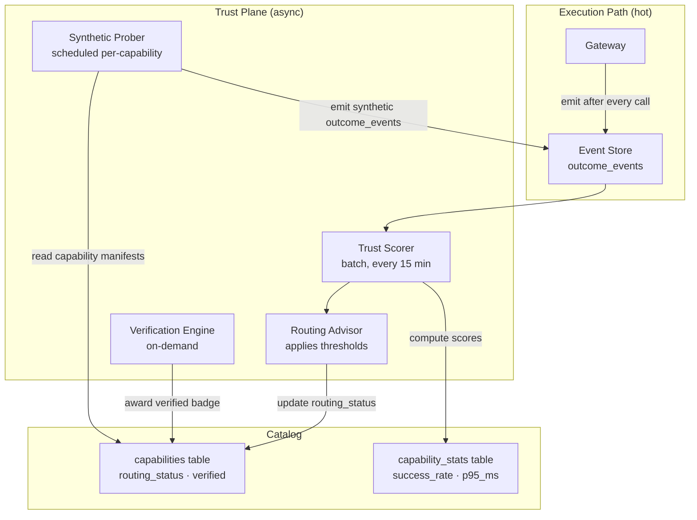
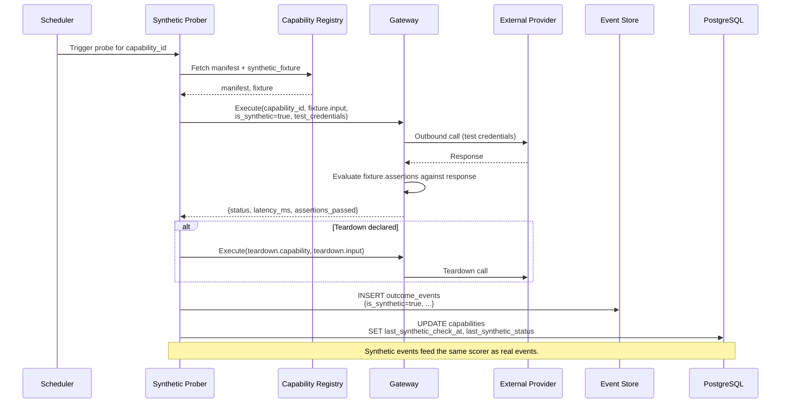
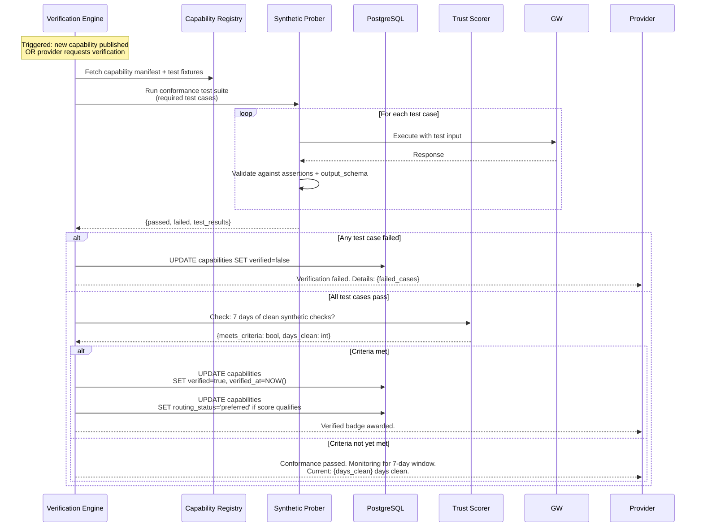
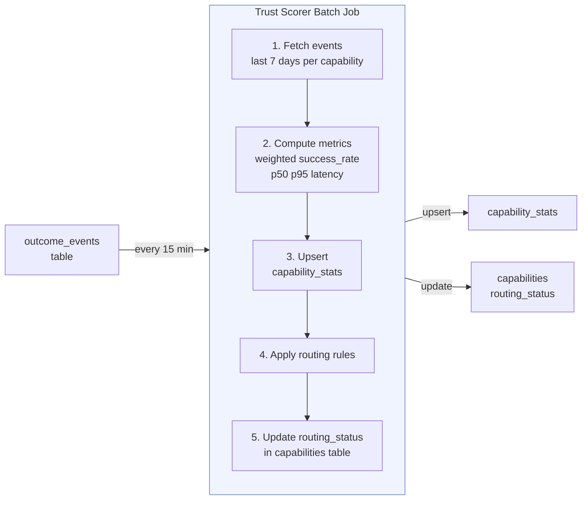

# 008 - Trust Plane

**Moat: Verified Agent Capabilities Marketplace**
*Synthetic checks, reliability scoring, hide/throttle rules, verified badge, and scoring pipeline*

---

## Overview

The Trust Plane is Moat's reliability measurement and routing layer. It runs **asynchronously** — it never blocks execution — but its outputs (scores, routing status, verified badge) directly affect what agents see in the catalog and how the gateway routes requests.

Trust is earned through **evidence**: real execution outcome events and periodic synthetic probes. It cannot be self-declared by providers.

---

## Architecture



---

## Synthetic Checks

### Purpose

Synthetic probes are scheduled test calls that verify a capability is reachable and returning correct responses. They are the Trust Plane's active health monitoring layer.

Synthetic calls:
- Use dedicated test credentials (isolated from tenant credentials)
- Are flagged `is_synthetic=true` in outcome_events
- Do not consume tenant budgets
- Do not count against tenant idempotency keys

### Probe Schedule

Each published capability has a configurable `probe_interval_minutes`. Defaults by risk class:

| Risk Class | Probe Interval | Rationale |
|-----------|---------------|-----------|
| `low` | 60 minutes | Read-only; low stakes |
| `medium` | 30 minutes | Write; moderate stakes |
| `high` | 15 minutes | Irreversible; needs frequent verification |
| `critical` | On-demand only | Cannot run synthetically; requires human approval |

### Probe Fixtures

Each capability manifest may declare a `synthetic_fixture` block specifying safe test inputs and expected output assertions:

```json
{
  "synthetic_fixture": {
    "input": {
      "channel": "C_MOAT_TEST",
      "text": "[SYNTHETIC PROBE - ignore] moat health check"
    },
    "assertions": [
      {"path": "ok", "equals": true},
      {"path": "ts", "type": "string"}
    ],
    "teardown": {
      "capability": "slack.delete_message",
      "input_template": {"channel": "C_MOAT_TEST", "ts": "{{output.ts}}"}
    }
  }
}
```

Teardown is optional but encouraged for capabilities with side effects (e.g., delete the test message after posting it).

### Probe Execution Flow



---

## Reliability Scoring

### Metrics Computed

| Metric | Definition | Window |
|--------|-----------|--------|
| `success_rate_7d` | `count(success=true) / count(*)` | Rolling 7 days |
| `p50_latency_ms` | 50th percentile of `latency_ms` | Rolling 7 days |
| `p95_latency_ms` | 95th percentile of `latency_ms` | Rolling 7 days |
| `total_calls_7d` | All outcome events (real + synthetic) | Rolling 7 days |
| `total_calls_30d` | All outcome events | Rolling 30 days |

### Success Rate Weighting

Not all outcome events are weighted equally. The scoring uses weighted success counting:

| Error Taxonomy | Weight |
|---------------|--------|
| `none` (success) | 1.0 |
| `provider_rate_limited` | 0.5 (capability responded; not a reliability failure) |
| `provider_invalid_input` | 0.7 (often caller error, not provider failure) |
| `provider_server_error` | 0.0 |
| `timeout` | 0.0 |
| `network_error` | 0.0 |
| `provider_auth_failure` | 0.0 |
| `provider_not_found` | 0.2 |
| `gateway_error` | Excluded (not a provider fault) |
| `policy_denied` | Excluded (not a provider fault) |

```
weighted_success_rate = sum(weight[taxonomy]) / count(events)
```

### Minimum Volume Requirement

A capability score is only displayed and acted upon if it has **at least 10 outcome events in the scoring window**. Capabilities with fewer events are shown as "Insufficient data" in the catalog and are not subject to hide/throttle rules.

---

## Hide and Throttle Rules

Routing Advisor applies threshold rules to scores. These rules run after every Trust Scorer batch.

### Rule Definitions

```python
from dataclasses import dataclass


@dataclass
class ThresholdRule:
    name: str
    condition: str              # human-readable
    routing_status: str         # resulting status


ROUTING_RULES: list[ThresholdRule] = [
    ThresholdRule(
        name="HIDE_LOW_SUCCESS_RATE",
        condition="success_rate_7d < 0.80 for >= 24 consecutive hours",
        routing_status="hidden",
    ),
    ThresholdRule(
        name="HIDE_SYNTHETIC_FAILURE",
        condition="last_synthetic_status = failure AND last_synthetic_check_at < NOW() - 2h",
        routing_status="hidden",
    ),
    ThresholdRule(
        name="THROTTLE_HIGH_LATENCY",
        condition="p95_latency_ms > 10000",
        routing_status="throttled",
    ),
    ThresholdRule(
        name="PREFERRED_VERIFIED_HEALTHY",
        condition="verified=true AND success_rate_7d >= 0.99 AND p95_latency_ms <= 2000",
        routing_status="preferred",
    ),
    ThresholdRule(
        name="ACTIVE_DEFAULT",
        condition="all other capabilities with sufficient data",
        routing_status="active",
    ),
]
```

### Rule Priority

Rules are evaluated in order. First matching rule wins:

1. `HIDE_LOW_SUCCESS_RATE` — hard hide (overrides throttle)
2. `HIDE_SYNTHETIC_FAILURE` — hard hide
3. `THROTTLE_HIGH_LATENCY` — throttle (shown in catalog with latency warning)
4. `PREFERRED_VERIFIED_HEALTHY` — preferred (shown first in catalog)
5. `ACTIVE_DEFAULT` — normal active state

### Routing Status Effects

| Routing Status | Catalog Visibility | Execution Allowed | Policy Decision Code |
|---------------|-------------------|------------------|---------------------|
| `active` | Visible, normal position | Yes | `POLICY_ALLOWED` |
| `preferred` | Visible, sorted first | Yes | `POLICY_ALLOWED` |
| `throttled` | Visible, with warning | Yes, with added latency warning | `POLICY_ALLOWED` |
| `hidden` | Not visible | No | `CAPABILITY_HIDDEN` |

**Hidden note:** Tenants with existing connections to a hidden capability can see it in their "My Connections" view (transparency), but it does not appear in the public catalog and cannot be executed via new connections.

### Recovery

A hidden capability returns to `active` status when:
- `success_rate_7d >= 0.80` sustained for 24 hours, AND
- `last_synthetic_status = success`

The recovery check runs on each Trust Scorer batch (every 15 minutes).

---

## Verified Badge

The Verified badge is Moat's highest trust signal. It indicates that a capability has passed a formal conformance test suite AND sustained healthy synthetic checks.

### Verification Criteria

All of the following must be true:

| Criterion | Threshold |
|-----------|----------|
| Conformance test suite | 100% pass rate (all test cases) |
| Synthetic check history | `success_rate_7d >= 0.99` |
| Synthetic check recency | Last check within `probe_interval_minutes * 2` |
| Routing status | Must be `active` or `preferred` (not `hidden` or `throttled`) |
| Continuous window | All criteria met for 7 consecutive days |
| Schema conformance | Input/output matches declared JSON Schema on all test cases |

### Conformance Test Suite

```python
from dataclasses import dataclass


@dataclass
class ConformanceTestCase:
    id: str
    description: str
    input: dict
    expected_output_schema: dict    # JSON Schema to validate output against
    expected_status: int            # Expected HTTP status code
    assertions: list[dict]          # JSONPath assertions on output


class ConformanceSuite:
    """
    Standard test cases every capability must pass for Verified badge.
    """

    REQUIRED_CASES = [
        "valid_input_success",          # Happy path
        "missing_required_field",       # Should return 400-equivalent
        "extra_unknown_fields",         # Should be handled gracefully
        "max_length_inputs",            # Boundary values
        "timeout_behavior",             # Does it respect timeout?
        "idempotent_execution",         # Same idempotency_key → same result
        "schema_output_conformance",    # Output matches output_schema
    ]
```

### Verification Award Flow



### Badge Revocation

The Verified badge is automatically revoked if:
- `success_rate_7d < 0.95` sustained for 48 hours
- Routing status transitions to `hidden`
- Capability manifest is modified (requires re-verification of new version)
- Manual revocation by Moat (e.g., security incident)

Revocation is logged in the capability's audit trail. Re-verification follows the same process.

---

## Scoring Update Pipeline



### Batch Job Specification

| Property | Value |
|----------|-------|
| Schedule | Every 15 minutes |
| Trigger | Cron scheduler (Cloud Scheduler or k8s CronJob) |
| Idempotent | Yes. Re-running produces same result (deterministic aggregation). |
| Failure behavior | Log error; retry on next schedule. Stale scores are safe. |
| Processing order | All active capabilities in parallel (bounded worker pool). |
| Partition pruning | Query uses `timestamp >= NOW() - 7d` to leverage monthly partitioning. |

### Score Query

```sql
-- Weighted success rate for a capability, rolling 7 days
SELECT
    capability_id,
    capability_version,
    COUNT(*) AS total_events,
    SUM(
        CASE error_taxonomy
            WHEN 'none'                    THEN 1.0
            WHEN 'provider_rate_limited'   THEN 0.5
            WHEN 'provider_invalid_input'  THEN 0.7
            WHEN 'provider_not_found'      THEN 0.2
            ELSE 0.0
        END
    ) / COUNT(*) AS weighted_success_rate,
    PERCENTILE_CONT(0.50) WITHIN GROUP (ORDER BY latency_ms) AS p50_ms,
    PERCENTILE_CONT(0.95) WITHIN GROUP (ORDER BY latency_ms) AS p95_ms
FROM outcome_events
WHERE
    capability_id = $1
    AND timestamp >= NOW() - INTERVAL '7 days'
    AND error_taxonomy NOT IN ('gateway_error', 'policy_denied')
GROUP BY capability_id, capability_version
HAVING COUNT(*) >= 10;  -- Minimum volume requirement
```

---

## Trust Score Public API

Scores are exposed via the REST API and MCP tool:

```json
GET /capabilities/slack.post_message/stats

{
  "capability_id": "slack.post_message",
  "capability_version": "1.2.0",
  "verified": true,
  "verified_at": "2026-01-15T00:00:00Z",
  "routing_status": "preferred",
  "metrics": {
    "success_rate_7d": 0.9987,
    "p50_latency_ms": 218,
    "p95_latency_ms": 844,
    "total_calls_7d": 14203,
    "data_window": "7d"
  },
  "synthetic": {
    "last_check_at": "2026-02-17T13:45:00Z",
    "last_status": "success",
    "probe_interval_minutes": 30
  },
  "computed_at": "2026-02-17T14:00:00Z"
}
```

**Privacy note:** `total_calls_7d` is the count across all tenants. Individual tenant volumes are not exposed in public stats.
